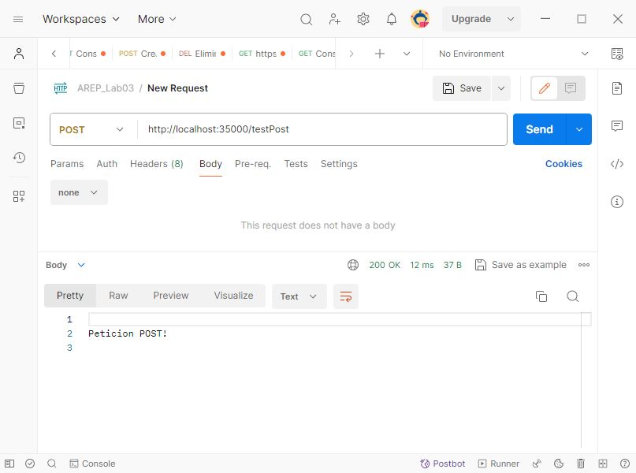

# TALLER 3:  MICROFRAMEWORKS WEB

Se construye un servidor web que soportar una funcionalidad similar a la de Spark. El cual permite el registro de servicios GET y POST usando funciones lambda. Además, se ha configurado un directorio con los archivos estáticos, tales como HTML, CSS, JS e imágenes (JPG) incluyendo la aplicación REST los cuales son leídos y retornados como se evidencio en el [Taller 2](https://github.com/AREP2024-1/AREP_Taller02.git).


---
### Prerrequisitos

* [Maven](https://maven.apache.org/): Es una herramienta de comprensión y gestión de proyectos de software. Basado en el concepto de modelo de objetos de proyecto (POM), Maven puede gestionar la construcción, los informes y la documentación de un proyecto desde una pieza de información central.

* [Git](https://learn.microsoft.com/es-es/devops/develop/git/what-is-git): Es un sistema de control de versiones distribuido, lo que significa que un clon local del proyecto es un repositorio de control de versiones completo. Estos repositorios locales plenamente funcionales permiten trabajar sin conexión o de forma remota con facilidad.

* [Postman](https://formadoresit.es/que-es-postman-cuales-son-sus-principales-ventajas/): Postman es una herramienta de colaboración y desarrollo que permite a los desarrolladores interactuar y probar el funcionamiento de servicios web y aplicaciones. proporcionando una interfaz gráfica intuitiva y fácil de usar para enviar solicitudes a servidores web y recibir las respuestas correspondientes.
---

### Instalación

1.Clonamos el repositorio

```
https://github.com/AREP2024-1/AREP_Taller03.git
```

2.Ingresamos a la carpeta del repositorio que clonamos anteriormente

```
cd AREP_Taller03
```

3.Contruimos el proyecto

```
mvn package
```

---

### Ejecución

1.Levantamos el servidor

***Windows:***

```
mvn exec:java -"Dexec.mainClass"="edu.eci.arep.ASE.app.HTTPServer" 
```

***MacOs y Linux:***

```
mvn exec:java -Dexec.mainClass="edu.eci.arep.ASE.app.HTTPServer" 
```

---
### Ejecución de los Casos de Uso

***Petición GET :***

Para esto seleccionamos el metodo GET y enviamos la siguiente URL en postman:
```
http://localhost:35000/test
```


En este caso tambien podemos realizar la prueba desde el navegador.

***Petición POST :***

Para esto seleccionamos el metodo POST y enviamos la siguiente URL en postman:
```
http://localhost:35000/testPost
```



***Trayendo el archivo especificado :***

Como se indicó en el [Taller 2](https://github.com/AREP2024-1/AREP_Taller02.git), estas son las URL utilizadas para realizar las pruebas para cada uno de los archivos:

**1. HTML**
```
http://localhost:35000/calculadora.html 
```

**2. JavaScript**
```
http://localhost:35000/calculadora.js
```

**3. CSS**
```
http://localhost:35000/estilos.css
```

**4. Imagen (jpg)**
```
http://localhost:35000/imagen.jpg
```

**5. API**

Solicitamos la aplicación del API, a través de cualquiera de las siguientes URL:

```
http://localhost:35000/
```

```
http://localhost:35000/index.html
```

**6. JSON**

Para este caso en especial obtendremos la información de la película Shadowhunters:

```
http://localhost:35000/movie/Shadowhunters
```

***No se encuentra el archivo especificado :***

Para ver como se comporta cuando no encuentra un archivo utilizamos la siguiente URL para este caso en específico:

```
http://localhost:35000/archivo.png
```

---
### Ejecución en diferentes sistemas operativos

**1. Windows :**


**2. Linux :**


---

### Construido con

* [Maven](https://maven.apache.org/): Es una herramienta de comprensión y gestión de proyectos de software. Basado en el concepto de modelo de objetos de proyecto (POM), Maven puede gestionar la construcción, los informes y la documentación de un proyecto desde una pieza de información central.

* [Git](https://learn.microsoft.com/es-es/devops/develop/git/what-is-git): Es un sistema de control de versiones distribuido, lo que significa que un clon local del proyecto es un repositorio de control de versiones completo. Estos repositorios locales plenamente funcionales permiten trabajar sin conexión o de forma remota con facilidad.

* [GitHub](https://platzi.com/blog/que-es-github-como-funciona/): Es una plataforma de alojamiento, propiedad de Microsoft, que ofrece a los desarrolladores la posibilidad de crear repositorios de código y guardarlos en la nube de forma segura, usando un sistema de control de versiones llamado Git.

* [Java -17](https://www.cursosaula21.com/que-es-java/): Es un lenguaje de programación y una plataforma informática que nos permite desarrollar aplicaciones de escritorio, servidores, sistemas operativos y aplicaciones para dispositivos móviles, plataformas IoT basadas en la nube, televisores inteligentes, sistemas empresariales, software industrial, etc.

* [JavaScript](https://universidadeuropea.com/blog/que-es-javascript/): Es un lenguaje de programación de scripts que se utiliza fundamentalmente para añadir funcionalidades interactivas y otros contenidos dinámicos a las páginas web.

* [HTML](https://aulacm.com/que-es/html-significado-definicion/): Es un lenguaje de marcado de etiquetas que se utiliza para crear y estructurar contenido en la web. Este lenguaje permite definir la estructura y el contenido de una página web mediante etiquetas y atributos que indican al navegador cómo mostrar la información.

* [CSS](https://www.hostinger.co/tutoriales/que-es-css): Es un lenguaje que se usa para estilizar elementos escritos en un lenguaje de marcado como HTML.

* [Postman](https://formadoresit.es/que-es-postman-cuales-son-sus-principales-ventajas/): Postman es una herramienta de colaboración y desarrollo que permite a los desarrolladores interactuar y probar el funcionamiento de servicios web y aplicaciones. proporcionando una interfaz gráfica intuitiva y fácil de usar para enviar solicitudes a servidores web y recibir las respuestas correspondientes.

* [Visual Studio Code](https://openwebinars.net/blog/que-es-visual-studio-code-y-que-ventajas-ofrece/): Es un editor de código fuente desarrollado por Microsoft. Es software libre y multiplataforma, está disponible para Windows, GNU/Linux y macOS.


## Autor

* **[Karol Daniela Ladino Ladino](https://www.linkedin.com/in/karol-daniela-ladino-ladino-55164b272/)** - [20042000](https://github.com/20042000)


## Licencia
**©** Karol Daniela Ladino Ladino. Estudiante de Ingeniería de Sistemas de la Escuela Colombiana de Ingeniería Julio Garavito

